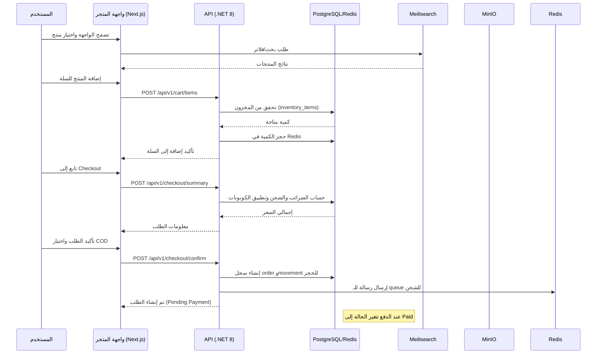

# وثيقة معمارية للنظام

## مقدمة

هذا المستند يشرح الهيكلية المقترحة لبناء متجر إلكتروني متكامل اعتمادًا على تقنية **Next.js 14** على الواجهة و **.NET 8** في الخادم مع التقيد بنمط **Clean Architecture**.  تتكوّن المنظومة من عدة طبقات ومكوّنات تتفاعل معًا لتوفير الأداء والموثوقية وإمكانية التوسع المطلوبة للتجارة الإلكترونية.

## مكوّنات النظام

- **العملاء (Frontends)**: يتوفر واجهتان Web مكتوبتان بـ **TypeScript/React/Next.js 14**. الأولى لزوار المتجر (**storefront**) والثانية للمسؤولين (**admin**). تستخدم الواجهتان **App Router** و **React Server Components (RSC)** مع خاصية **Suspense** لتقليل زمن تحميل الصفحات والحد من عمليات نقل البيانات غير الضرورية【70542373698938†L462-L480】. يدعم كلاهما واجهة RTL وعملة الدينار العراقي (IQD) وملفات ترجمة متعددة.
- **واجهة برمجة التطبيقات (API)**: خادم مبني على **C# .NET 8** باستخدام **Minimal APIs** أو **ASP.NET Core Web API**. يوفر واجهة RESTful على المسار `/api/v1/...` ويستخدم مخطط **OpenAPI 3.1** لتوليد ملف `openapi.yaml`. يطبق Clean Architecture بحيث تنقسم الشفرة إلى طبقات **Domain** و **Application** و **Infrastructure** و **WebApi** مما يسهّل الاختبار والصيانة【244055884170707†L167-L180】. تستفيد Minimal APIs من التحسينات الجديدة في .NET 8 مثل الأداء المحسّن، دعم JWT، التكامل مع OpenAPI، والتحقق المدمج للمدخلات【735124860365313†L74-L87】.
- **قاعدة البيانات (PostgreSQL 16)**: تخزن جميع الكيانات الأساسية (المستخدمون، المنتجات، الطلبات...). الإصدار 16 يقدم تحسينات في الأداء تشمل التسريع باستخدام SIMD وزيادة الكفاءة في عمليات COPY والتوزيع المتوازي للانضمامات【959828569856209†L42-L78】. تم تصميم قاعدة البيانات وفق مخطط علائقي مع قيود وفهارس مناسبة.
- **التخزين للكائنات (MinIO)**: يستخدم لتخزين الوسائط (صور وفيديوهات) مع توافق كامل مع S3 وسرعة استجابة أقل من 10 مللي ثانية【220636840275457†L138-L140】.
- **الكاش والجلسات والقوائم (Redis 7)**: يستخدم لتخزين الجلسات، التكوين المؤقت، وإدارة الطوابير للمهام غير المتزامنة. يدعم نشرات الـ pub/sub لحالات الطلبات.
- **البحث السريع (Meilisearch)**: محرك بحث اختياري لكنه قوي يوفر بحثًا دقيقًا وفوريًا مع فلاتر وتصنيفات وإقتراحات متقدمة【553568144780314†L86-L160】. يسهّل اكتشاف المنتجات ويوفّر ردودًا أقل من ‎50 مللي ثانية.
- **المصادقة والأمان**: يتم تخزين كلمات المرور باستخدام **Argon2id** أو **bcrypt** بعتاد قوي، حسب توصيات OWASP【979016979255752†L190-L200】. يعتمد نظام المصادقة على **JWT** بمفتاحين: Access Token قصير المدى (5–15 دقيقة) وRefresh Token يستخدم لتجديد الجلسة، وهو ما يقلّل من إمكانية إساءة الاستخدام【117256363097690†L153-L161】. يمكن تمكين المصادقة الثنائية للمشرفين. يتم تطبيق قيود CORS ومحددات معدل الاتصال، كما يتم تسجيل عمليات الإدارة في **AuditLog**.
- **القياس والمراقبة (Observability)**: تعتمد المنظومة على **OpenTelemetry** لجمع السجلات والقياسات والتتبعات، وهي إطار مفتوح المصدر يوفّر معيارًا موحّدًا لجمع البيانات ومراقبتها【883264704109337†L40-L62】. تُرسل السجلات إلى **ELK** أو **Loki/Promtail/Grafana** باستخدام **Serilog**.
- **الحاويات والأتمتة**: كل مكوّن يُشغّل في حاوية Docker مع ملفات `Dockerfile` و`docker-compose` للبيئة التطويرية والإنتاجية. تستخدم **GitHub Actions** لبناء الصور، تشغيل الاختبارات، ترحيل قاعدة البيانات، ونشر التطبيق.

## تدفق البيانات الرئيسي

يدعم النظام عدة تدفقات مثل تصفح المنتجات، إضافة المنتجات للسلة، عملية الدفع عند الاستلام (COD)، إدارة المخزون والطلبات. الشكل التالي يوضّح التسلسل العام لعملية شراء COD في شكل **Mermaid Sequence Diagram**:

## وصف التدفقات

1. **التصفح والبحث**: عند زيارة المستخدم للمتجر، تعتمد الواجهة على **Meilisearch** لتوفير بحث سريع مع فلاتر واقتراحات، وهذا يزيد من تجربة المستخدم ويقلّل من زمن الاستجابة【553568144780314†L86-L160】.
2. **إدارة السلة والمخزون**: تُرسل طلبات إضافة السلع للسلة إلى API عبر REST. يتم التحقق من الكمية المتوفرة في جدول `inventory_items` وحجز الكمية مؤقتًا في Redis. عند تأكيد الطلب، يتم خصم الكمية فعليًا من المخزون.
3. **الدفع**: حالياً يوفّر النظام الدفع عند الاستلام (COD) أو عبر بوابات محلية مثل ZainCash/AsiaHawala باستخدام Webhooks. حالات الدفع تشمل `Pending`, `Authorized`, `Paid`, `Failed`, `Refunded`. يتم تحويل الطلب إلى حالة `Pending Payment` حتى يتأكد الدفع أو يتم رفضه.
4. **اللوجستيات والشحن**: بعد نجاح الدفع أو تأكيد COD، يتم إرسال رسالة إلى نظام الشحن (queue) لإعداد الشحنة. يمكن إضافة مزودي شحن محليين عبر نمط الـ Driver.
5. **الإدارة وRBAC**: يوفّر النظام لوحة إدارة بواجهة RTL للتحكم بالفئات والمنتجات والطلبات والمستخدمين والأدوار والصلاحيات. يُمكن إدارة صلاحيات جديدة وربطها بالأدوار عبر جدول `permissions` و `role_permissions`.

## المزايا غير الوظيفية

- **الأداء**: اختيار Next.js 14 مع RSC يقلّل التحميل الزائد ويحسّن الأداء【70542373698938†L462-L480】، بينما يوفر .NET 8 Minimal APIs أداءً أفضل وتكاملاً مع OpenAPI وJWT【735124860365313†L74-L87】. PostgreSQL 16 يقدّم تحسينات في الأداء تشمل معالجة متوازية وتشغيل أسرع للانضمامات【959828569856209†L42-L78】. Meilisearch يُحقق استجابة أقل من 50 مللي ثانية للبحث【553568144780314†L86-L160】. MinIO يضمن زمن وصول منخفض جدًا【220636840275457†L138-L140】.
- **الأمان**: اعتماد Argon2id أو bcrypt لحماية كلمات المرور【979016979255752†L190-L200】، واستخدام JWT قصيرة العمر مع Refresh Tokens لتقليل مخاطر التسريب【117256363097690†L153-L161】، وإدماج OpenTelemetry لجمع السجلات والقياسات【883264704109337†L40-L62】. يتضمن النظام ممارسات Rate Limiting, CSRF, CORS، وتدوين أحداث التدقيق.
- **قابلية التوسع والتخصيص**: التصميم المعتمد على Clean Architecture وعزل الطبقات يسمح بإضافة مزايا أو تغيير الخدمات بسهولة دون المساس بالنواة【244055884170707†L167-L180】. يمكن إضافة بوابات دفع جديدة أو مزودي شحن عبر واجهات مجردة في طبقة **Application**.

## خاتمة

يوفر هذا التصميم إطارًا متينًا لتطوير متجر إلكتروني عالي الأداء وقابل للتوسع. باستخدام تقنيات حديثة مثل Next.js 14 و.NET 8 وPostgreSQL 16 وMeilisearch وMinIO، يتم الجمع بين تجربة مستخدم ممتازة وبنية خلفية قوية وآمنة. تعتمد الطبقات النظيفة والواجهات المنفصلة على تقليل الترابط وتسهيل الاختبارات والتطوير المستقبلي.